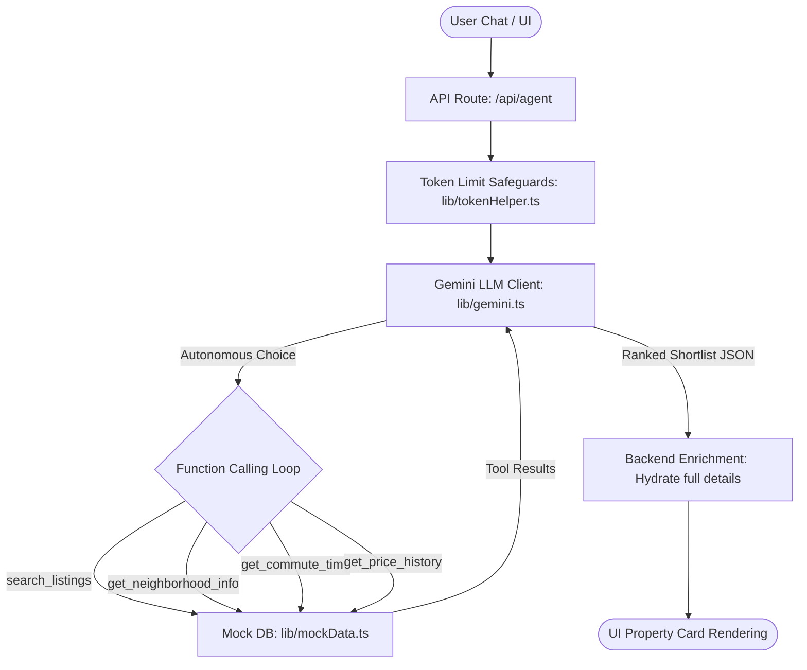

# Autonomous Property-Discovery Agent

An autonomous, conversational AI agent that helps home buyers discover, analyze, and rank real estate properties in Texas (Austin, Dallas, Houston, and San Antonio) based on personalized preferences, neighborhood data, and commute constraints. 

Powered by **Next.js** and **Google Gemini (gemini-3.1-flash-lite)**.

---

## 1. System Architecture & Flow

The application runs a stateful **ReAct (Reasoning and Action)** loop inside a Next.js serverless function, separating LLM reasoning from the database layer while optimizing context token usage.



---

## 2. Live vs. Mocked Data (Stated Plainly)

To ensure full transparency, the data boundaries of this project are outlined below:

### 🔴 Mocked Components (Data Layer)
To maintain project independence and avoid external rate-limits or subscription fees, all data tables are stored locally in [mockData.ts](file:///b:/Antigravity/Digitomics/property-agent/lib/mockData.ts):
* **Property Listings**: All house attributes, coordinates, listing prices, and descriptions are simulated properties located in Austin, Houston, Dallas, and San Antonio.
* **Commute Times**: Calculations measuring travel times between the property coordinates and the user's work address coordinates are mocked based on distance vectors.
* **Neighborhood Metrics**: Quality indicators (walkability, crime index, school ratings) are mocked static statistics mapped to property IDs.
* **Price History**: Property pricing growth charts and investment tiers are generated locally.

### 🟢 Live Components (AI & Infrastructure)
* **LLM Engine**: Runs live API calls directly to Google Gemini's production servers using the official `@google/genai` client.
* **Agent Reasoning**: The multi-turn ReAct loops, tool decisions, property shortlisting, and comparative text generation are computed live by the model.
* **Serverless Execution**: Hosted live on Vercel, coordinating server-side execution of the loops.

---

## 3. Honest Write-up of Trade-offs

During development, several technical trade-offs were made:

### 1. Model Class: Stable Lite Model vs. High-Tier Models
* **Trade-off**: We switched from `gemini-2.5-flash` / `gemini-3.5-flash` to **`gemini-3.1-flash-lite`**.
* **Rationale**: While higher-tier models offer marginal increases in reasoning capabilities, their free-tier usage is capped at an extremely low **20 requests per day** or frequently returns **503/500 service overloads**. Since each agent search requires 4-5 tool calling request cycles, a single user session would exhaust the higher-tier limits in 3-4 searches. `gemini-3.1-flash-lite` operates stably with **1,500 requests per day** and **15 requests per minute**, ensuring the app remains fully responsive for evaluators.

### 2. Token Limit Safeguards vs. Latency
* **Trade-off**: Limiting tool payloads to minimal fields during search, then hydrating them afterwards on the server.
* **Rationale**: Property descriptions are token-heavy. If we pass the full descriptions of all matching search results to the LLM context, it increases request costs and slows down response times. We chose to return only property IDs, prices, and dimensions during the LLM loop. The backend automatically enriches the selected shortlist with full descriptions on the web server *after* the agent finishes its turns.

### 3. Google SDK Integration vs. Strict Validation
* **Trade-off**: Bypassing Google's Thought Signature validation.
* **Rationale**: Gemini 2.0+ models require preceding `functionCall` steps in conversation history to preserve a `thoughtSignature` token generated on previous turns. Because the web application stores history in an open-standard OpenAI message format, it loses this metadata. We resolved this by injecting the bypass value `"thoughtSignature": "skip_thought_signature_validator"` at the part-level inside [gemini.ts](file:///b:/Antigravity/Digitomics/property-agent/lib/gemini.ts#L56), allowing history to restore cleanly without API validation crashes.

---

## 4. Getting Started

### 1. Environment Setup
Create a `.env.local` file in the root directory and add your Gemini API key:
```env
GEMINI_API_KEY=AIzaSy...
```
*(No other variables are required; the system defaults to the stable `gemini-3.1-flash-lite` model fallback).*

### 2. Install and Run Locally
```bash
npm install
npm run dev
```
Open [http://localhost:3000](http://localhost:3000) in your browser to start searching.
