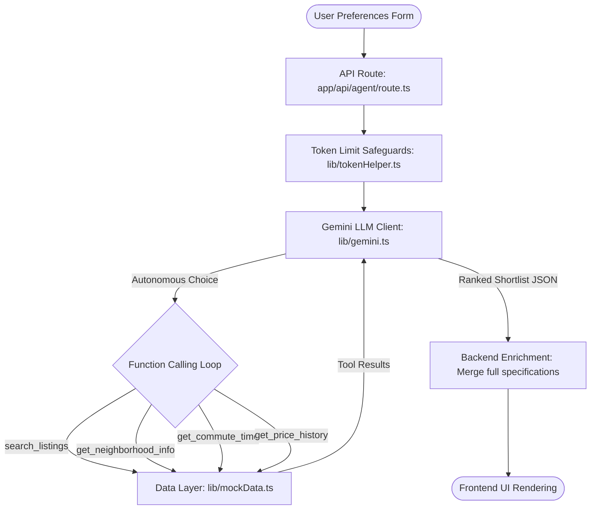

# Autonomous Property-Discovery Agent

An autonomous, conversational AI agent that helps home buyers discover, analyze, and rank real estate properties in Texas (Austin, Dallas, Houston, and San Antonio) based on personalized preferences, neighborhood data, and commute constraints. 

Powered by **Next.js** and **Google Gemini (gemini-2.5-flash)** function calling.

---

## 1. System Architecture & Flow

The application follows the architecture below, separating LLM reasoning from the data ingestion layer and optimizing context token limits.



---

## 2. Technical Design & Short Write-up

### Approach & Core Engine
The agent uses a Next.js API route that coordinates a multi-turn, autonomous function-calling loop. When a user submits preferences, the agent starts by querying the listings database. It then dynamically decides which properties to look up depending on the user's priorities (e.g., fetching school ratings only for listings it wants to evaluate, checking commute times for matching candidate coordinates). 

### How Ranking Works
Instead of using a rigid, hardcoded scoring formula (which fails to capture human trade-offs), the ranking is done entirely through **LLM reasoning**. The model weighs conflicting signals (e.g., a property with excellent schools but a longer commute vs. one with a lower price but higher crime) against the user's explicit priority rank. Every recommendation includes a structured justification split into three components:
1. **Selection**: Why the property fits the core criteria.
2. **Trade-offs**: Highlights any downsides or caveats.
3. **Comparison**: Explains why it ranked higher than the properties below it.

### Token Optimization & Context Management
To stay within Gemini's token limits and protect response latency:
* **Backend Data Enrichment**: The search tool only returns minimal property specs (e.g., ID, price, bed/bath count, square footage) during the LLM loop. Once the LLM decides on its final shortlist, the backend enriches the recommendations with full specifications (descriptions, lot sizes, HOA fees) from the local database before serving the client.
* **Sliding Window History**: The loop prunes intermediate tool payloads, retaining only the system instructions, original request, and the most recent tool interactions.

### Future Improvements
1. **Live MLS Sync**: Connect the data layer to actual MLS API feeds (e.g., Bridge Interactive or RentCast) for live inventory.
2. **Vector RAG on Descriptions**: Use embeddings to search semantic keywords (e.g., "shaded backyard" or "vaulted ceilings") in property descriptions.

---

## 3. Getting Started

### 1. Environment Setup

Create a `.env.local` file in the root directory and add your Gemini API key:

```env
GEMINI_API_KEY=AIzaSy...
GEMINI_MODEL=gemini-2.5-flash
```

*Note: No other external API keys are required.*

### 2. Run the Development Server

Install dependencies and start the local Next.js dev server:

```bash
npm install
npm run dev
```

Open [http://localhost:3000](http://localhost:3000) in your browser to test the agent interface.
